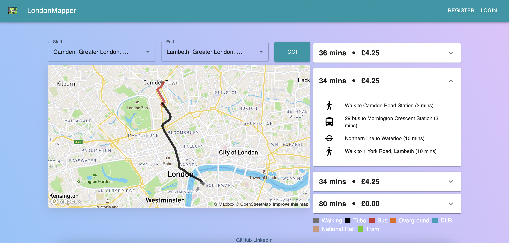
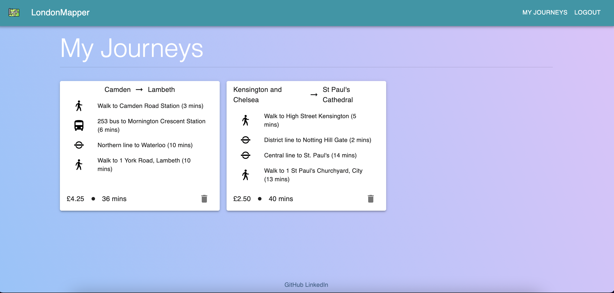

# Project 4: London Mapper

---
## Overview
---
This was the fourth project for the Software Engineering Immersive course with GA, which consisted of a one week solo full-stack project.

You can find the deployed version of the project [here](https://london-mapper.herokuapp.com/).  

---
## Brief
---
* Build a full-stack application by making your own backend and your own front-end
* Use a Python Django API using Django REST Framework to serve your data from a Postgres database
* Consume your API with a separate front-end built with React
* Be a complete product which most likely means multiple relationships and CRUD functionality for at least a couple of models
* Implement thoughtful user stories/wireframes that are significant enough to help you know which features are core MVP and which you can cut
* Have a visually impressive design

---
## Technologies Used
---
* JavaScript (ES6+)
* Python
* Django
* PostgreSQL
* React & React Router
* Material UI (MUI)
* HTML5, CSS3, and SASS
* Axios
* VSCode
* Pylint
* Git & GitHub
* TablePlus


## Approach
---


#### Planning
In the beginning I brainstormed different ideas that met the requirements. I decided to create a city mapper clone leveraging mapbox and TFL api. I chose this idea as it had real-world utility. Apps like Citymapper and the TfL Journey Planner are hugely popular, and I wanted to challenge myself to process real-world data and use multiple third party APIs.

I began by making the authentication functionality on the back-end using django and jwt. After setting up custom user authentication I swapped over to the front-end.

#### Searching
I wanted my search to support multiple types of search queries: places, postcodes etc. This is to make it as user-friendly as possible, and to enable users to search for their own home address, or search for the name of a restaurant or pub for example. To do this, I used the mapbox autocomplete api and send requests on every input by the user. Additionally I had to maintain the state of the array of choices in my autocomplete the user input and the final choice selected by the user. This had to be done for both the journey start and end locations.

```
useEffect(() => {
    const getData = async () => {
      const { data } = await axios.get(`https://api.mapbox.com/geocoding/v5/mapbox.places/${startSearch}.json?type=poi&bbox=-0.5094,51.2744,0.2643,51.7026&access_token=${mapboxgl.accessToken}`)
      setStartArray(data.features)
      const nameArray = data.features.map(item => item.place_name)
      setStartLocationOptions(nameArray)
    }
    getData()
  }, [startSearch])

  const handleStartChange = (e) => {
    setStartSearch(e.target.value)
  }
```

#### Mapping the Journey
When a user selects a search result, the latitude and longitude of the location is used to make a query to the TfL API, and displays the options for travel on the search page. When a journey is selected, the journey's legs and modes are plotted onto the map, which can be scrolled and interacted with. The legs are coloured according to mode, and the steps are shown in the accordions to the right of the map. In order to achieve the fluid hover effect I had to loop over the map.current object and remove previously added layers and then add layers for the currently selected journey.
```
useEffect(() => {
    if (!journeyHover) return
    for (const [key, value] of Object.entries(map.current.style._layers)) {
      parseFloat(key) ? map.current.removeLayer(value.id) : null
    }
    lineData.forEach((points, i) => {
      if (map.current.getSource(points[0][0])) {
        map.current.removeSource(points[0][0])
      }
      map.current.addSource(points[0][0], {
        'type': 'geojson',
        'data': {
          'type': 'Feature',
          'properties': {},
          'geometry': {
            'type': 'LineString',
            'coordinates': points,
          },
        },
      })
      map.current.addLayer({
        'id': `${points[0][0]}`,
        'type': 'line',
        'source': `${points[0][0]}`,
        'layout': {
          'line-join': 'round',
          'line-cap': 'round',
        },
        'paint': {
          'line-color': lineColours[journeys[journeyHover].legs[i].mode.id],
          'line-width': 6,
          'line-opacity': 0.8,
          'line-dasharray': lineDash[journeys[journeyHover].legs[i].mode.id],
        },
      })
    })
  }, [journeyHover])

```

#### Save Journeys
After completing the main frontend functionality of searching for journeys and mapping them on mapbox I began creating the model and views to dave a journey in the backend. In my journey model I used the JSONfield option in Django to store an array of each of the legs. On the frontend users are able to save specific journeys and view them in the My Journeys page.


---
## Screenshots
---




## Challenges/Wins

### Multiple API's
TFL and mapbox api had different formats for how the data needed to be sent. I had to normalise the data before making each query. Additoinally I had not used mapbox before and had to quickly figure out how it could be used in a React app.

## Key Learnings
This project required me to use lots of documentation for both the apis. I had to use the examples I found as a foundation upon which I could add to as there were often differences between the effect I wanted to achieve and what was shown.
